## Part 1. Запуск нескольких docker-контейнеров с использованием docker compose

1) Написать Dockerfile для каждого отдельного микросервиса. Необходимые зависимости описаны в материалах. В отчете отобразить размер собранных образов любого сервиса различными способами.<br>

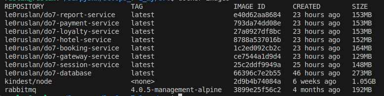<br>

2) Написать docker-compose файл, который осуществляет корректное взаимодействие сервисов. Пробросить порты для доступа к gateway service и session service из локальной машины. Помощь по docker compose в материалах.

3) Собрать и развернуть веб-сервис с помощью написанного docker compose файла на локальной машине.

4) Прогнать заготовленные тесты через postman и удостовериться, что все они проходят успешно. Инструкцию по запуску тестов можно найти в материалах. В отчете отобразить результаты тестирования.<br>
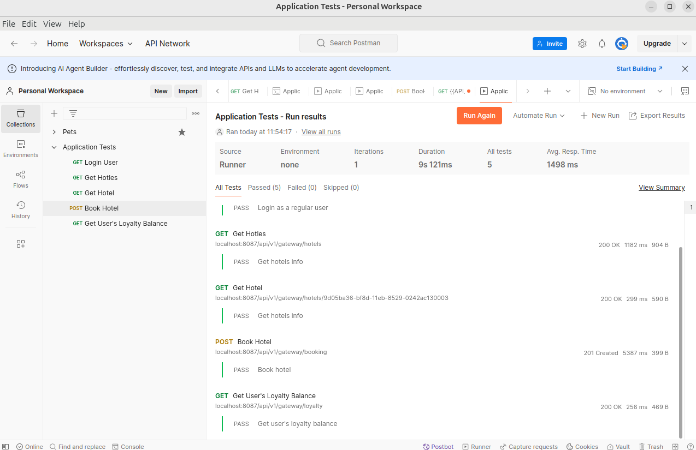<br>

## Part 2. Создание виртуальных машин

Пришло время заготовить основу для будущих узлов кластера. Создадим виртуальную машину.

**== Задание ==**

1) Установить и инициализировать Vagrant в корне проекта. Написать Vagrantfile для одной виртуальной машины. Перенести в виртуальную машину исходный код веб-сервиса в рабочую директорию виртуальной машины. Помощь по vagrant в материалах.
* Инициализация:
```
vagrant init
```
* Vagrantfile для запуска ВМ

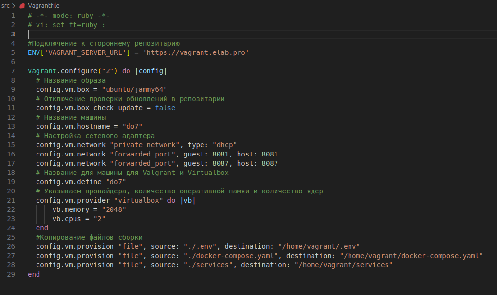<br>

2) Зайти через консоль внутрь виртуальной машины и удостовериться, что исходный код встал куда нужно. Остановить и уничтожить виртуальную машину.

* Подключение к ВМ
```
vagrant ssh
```
* Содержимое рабочей директории:<br>

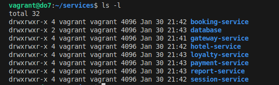<br>

* Остановить ВМ:
```
vagrant halt
```
* Уничтожение ВМ:
```
vagrant destroy
```

## Part 3. Создание простейшего docker swarm

Ну вот и пришло время создания твоего первого docker swarm!

**== Задание ==**

1) Модифицировать Vagrantfile для создания трех машин: manager01, worker01, worker02. Написать shell-скрипты для установки docker внутрь машин, инициализации и подключения к docker swarm. Помощь с docker swarm материалах.

* Vagrantfile для запуска трёх ВМ:
    * manager01:<br>

    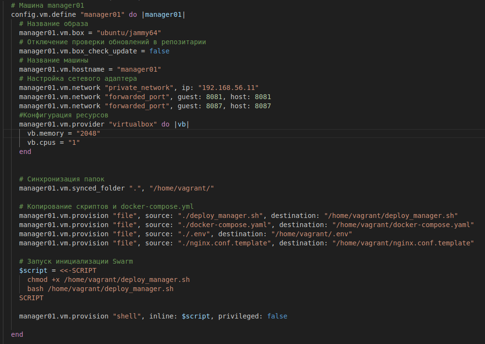

    * worker01 и worker02 идентичные:

    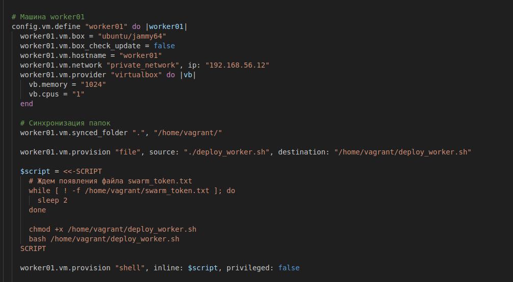

* Vagrantfile для запуска трёх ВМ:
    * manager01:<br>

    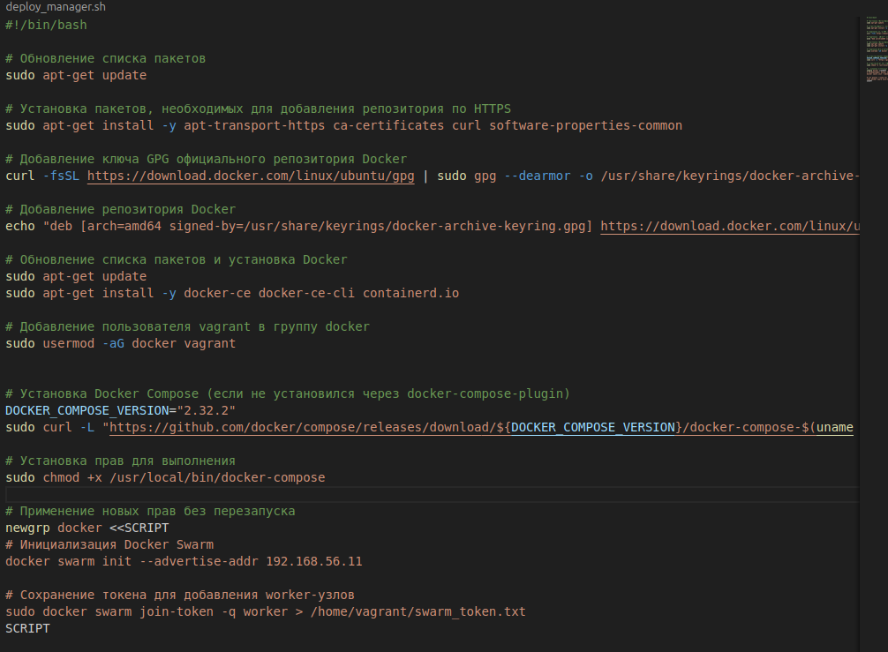

    * worker01 и worker02 идентичные:

    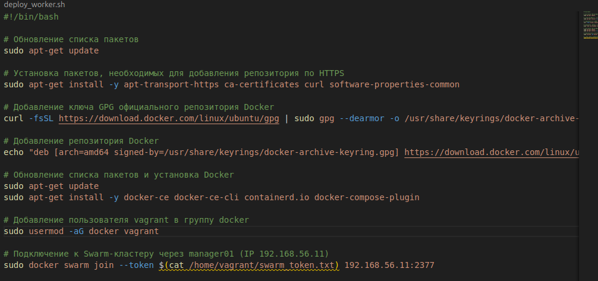

2) Загрузить собранные образы на docker hub и модифицировать docker-compose файл для подгрузки расположенных на docker hub образов.

* Пример команды для сборки образа и пуша в DockerHub:
```
docker build -t le0ruslan/do7-loyalty-service:latest -f Dockerfile .
docker push le0ruslan/do7-loyalty-service:latest
```
* Подгрузка в docker-compose из DockerHub:
```
...
loyalty-service:
    image: le0ruslan/do7-loyalty-service:latest
...
```

3) Поднять виртуальные машины и перенести на менеджер docker-compose файл. Запустить стек сервисов, используя написанный docker-compose файл.<br>
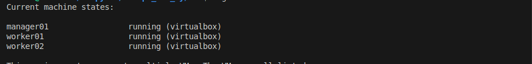<br>
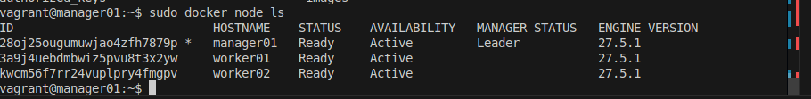<br>
* Команда для запуска приложения: 
```
 sudo docker stack deploy -c docker-compose.yaml my_deploy
```
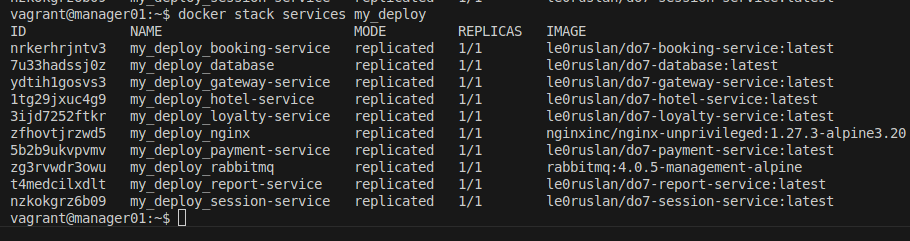<br>
4) Настроить прокси на базе nginx для доступа к gateway service и session service по оверлейной сети. Сами gateway service и session service сделать недоступными напрямую.
* nginx.conf:

5) Прогнать заготовленные тесты через postman и удостовериться, что все они проходят успешно. В отчете отобразить результаты тестирования.
* GET login:<br>
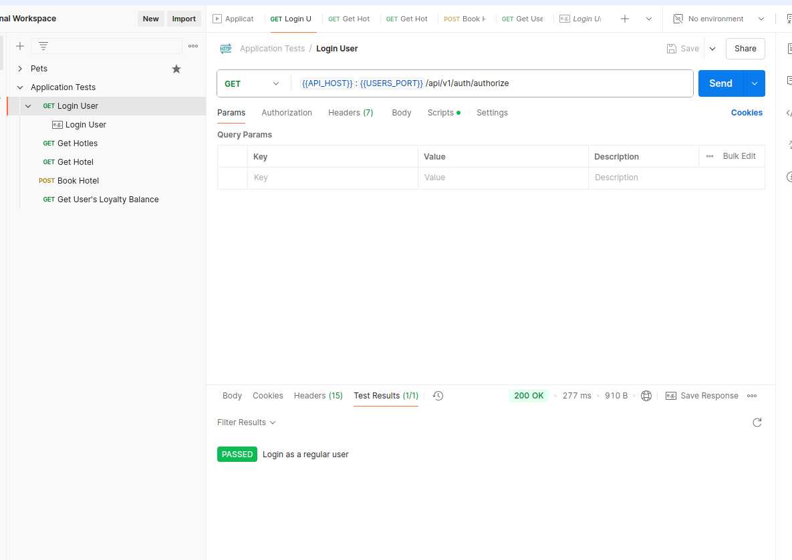
* GET hotel:<br>
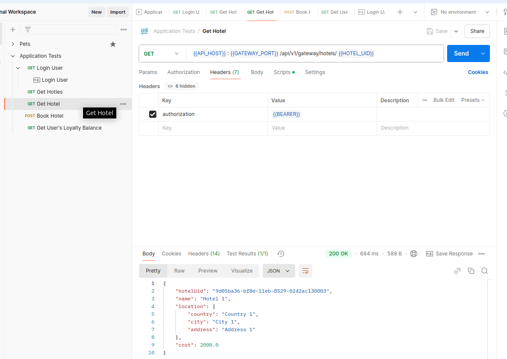
* GET hotels:<br>
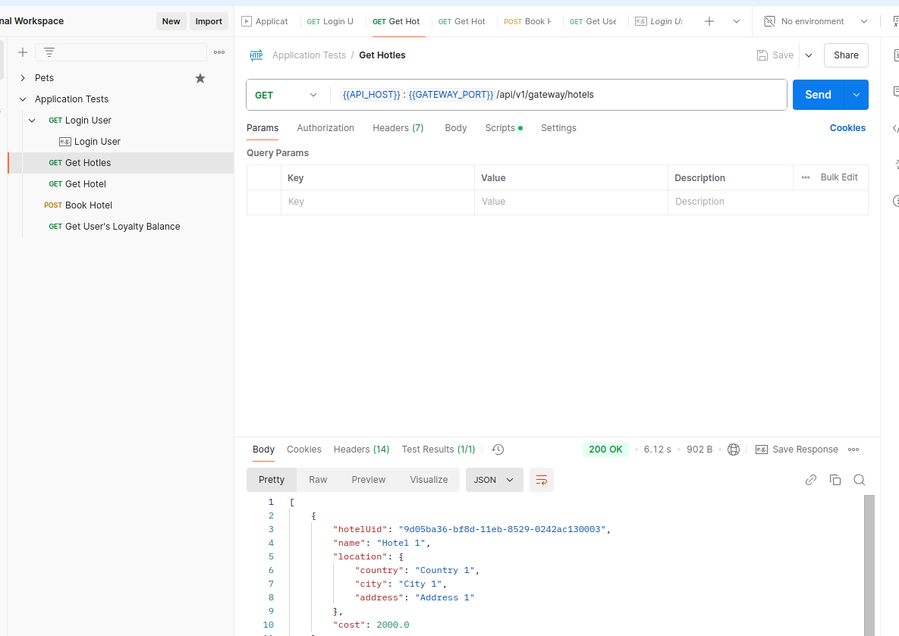
* POST book hotel:<br>
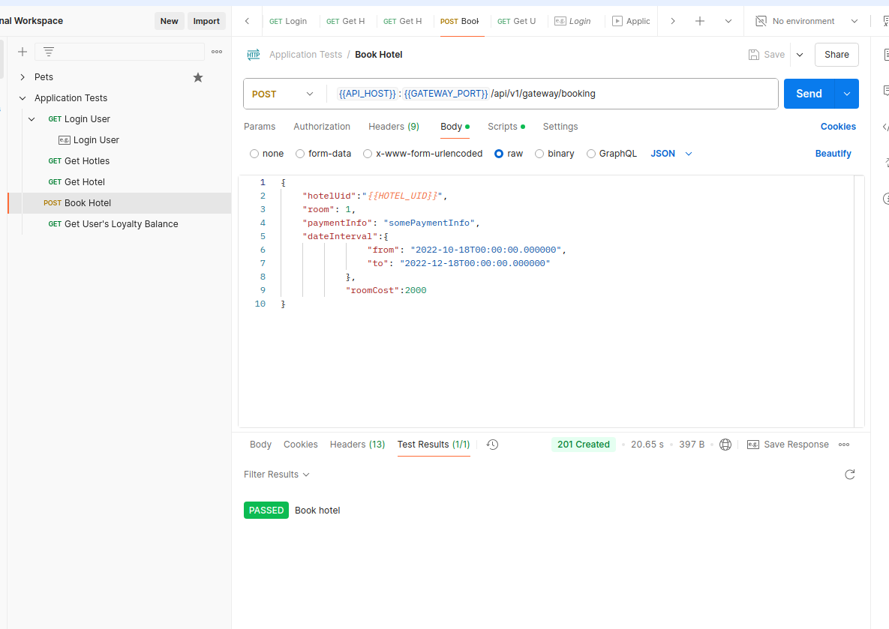
* GET loyalty:<br>
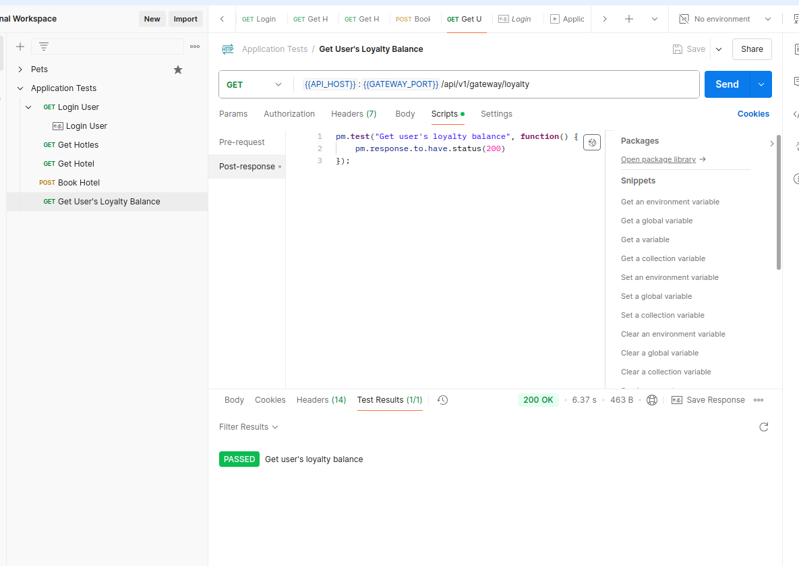
6) Используя команды docker, отобразить в отчете распределение контейнеров по узлам.
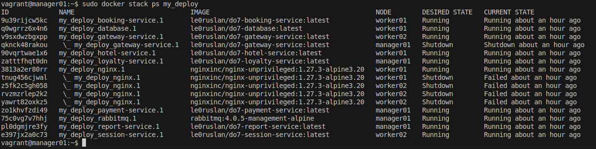
7) Установить отдельным стеком Portainer внутри кластера. В отчете отобразить визуализацию распределения задач по узлам с помощью Portainer.

* Написать файл для запуска<br>
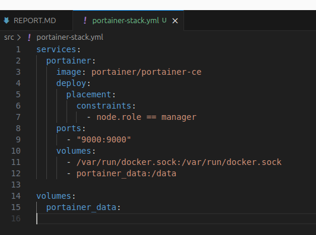
* Запустить стэк
```
sudo docker stack deploy -c portainer-stack.yml portainer
```
* Перейти на страницу<br>
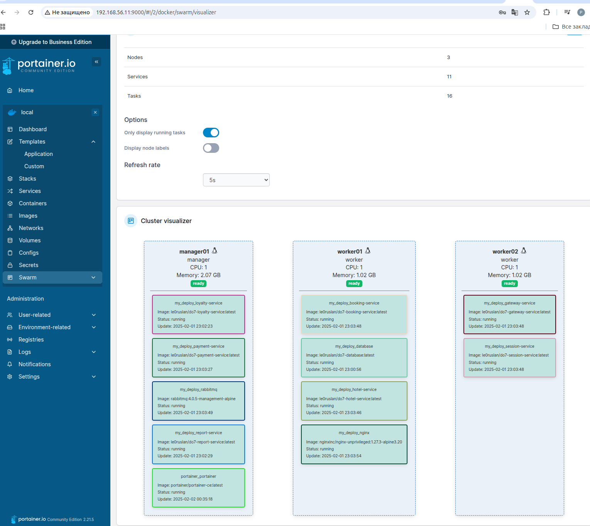